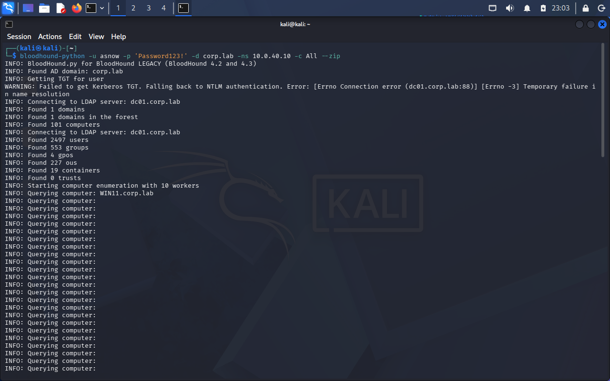
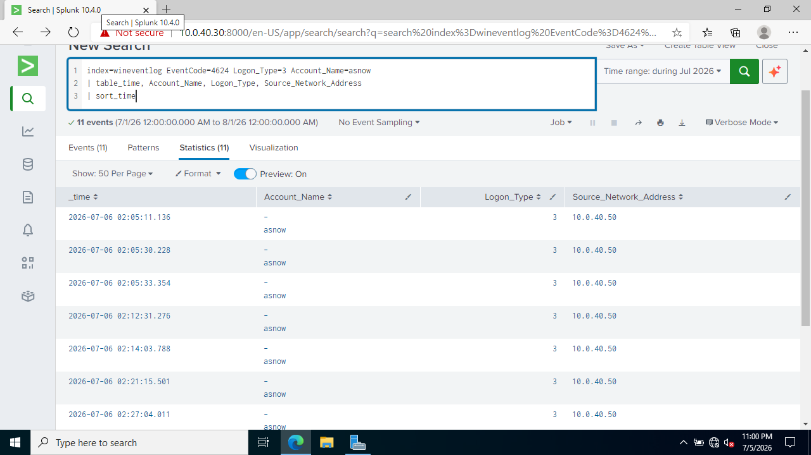

# Detection: BloodHound / AD Enumeration

## The attack in one sentence

BloodHound enumerates the entire directory over LDAP and maps the relationships — including the shortest paths from any account to Domain Admin.

## How I ran it

From KALI:

```bash
bloodhound-python -u asnow -p 'Password123!' -d corp.lab -ns 10.0.40.10 -c All --zip
```

The Kerberos TGT request failed on time skew, so the tool fell back to NTLM authentication and completed collection — it found the domains, computers, users, groups, and sessions. The resulting `.zip` imported into the BloodHound GUI, where "Shortest Paths to Domain Admins" mapped the attack paths.



## The detection 

My first instinct was **Event ID 4662** (directory object access), which the guides point at for BloodHound. In my lab it didn't work: the only 4662 events were routine `DC01$` computer-account activity — no user-attributed directory access from the enumeration. LDAP-based enumeration is genuinely hard to catch from standard Windows audit logs without SACLs on sensitive objects. This is a real detection gap, not a lab mistake.

Because BloodHound fell back to NTLM, each collection phase authenticated to the DC — producing a cluster of **Event ID 4624** Type 3 (network) logons for `asnow` from KALI's IP in a very short window:

```
index=wineventlog EventCode=4624 Account_Name=asnow Logon_Type=3
| stats count by Source_Network_Address
```



~11 network logons from a single source in seconds is not human behavior

## Remediation

- Put SACLs on sensitive AD objects so directory access actually logs (4662).
- Alert on abnormal authentication volume from a single source (the 4624 burst).
- Disable unnecessary NTLM; enforce Kerberos with correct time sync so fallbacks stand out.

