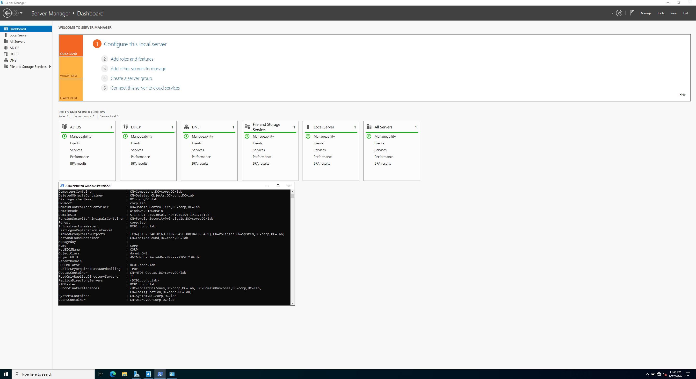
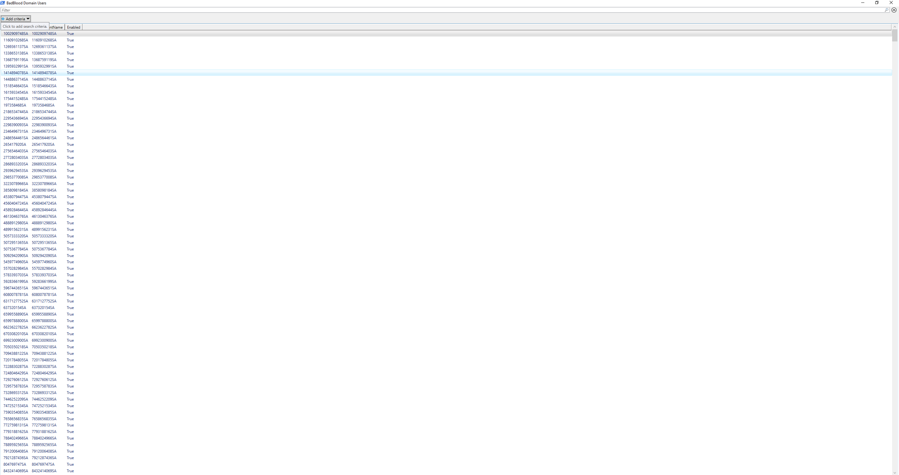
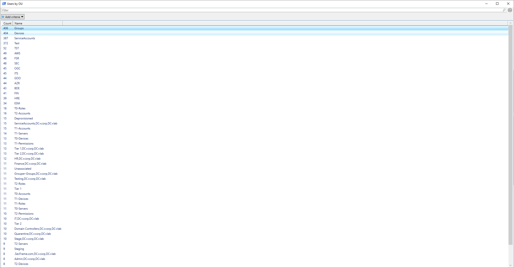
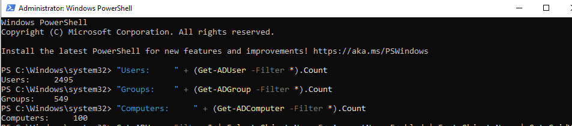
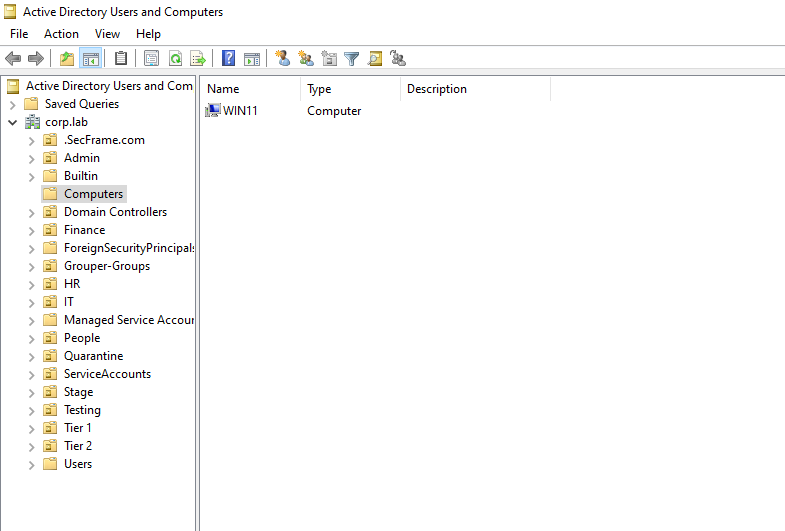

# 01 — Building the Domain 

Standing up `corp.lab` from a bare Windows Server: promote the DC, populate the directory, and join a client.

## Promote DC01

DC01 starts as a plain Windows Server 2022 and becomes the brain of the domain — Active Directory, DNS, and DHCP.

**Static IP** (a DC must never move):

| Field | Value |
|-------|-------|
| IP address | `10.0.40.10` |
| Subnet mask | `255.255.255.0` |
| Default gateway | blank (no router on the isolated net) |
| Preferred DNS | `127.0.0.1` (it becomes its own DNS after promotion) |

Then: rename the machine to `DC01`, install the **Active Directory Domain Services** role, and promote to a domain controller as a **new forest** with root domain `corp.lab`. DNS installs automatically; set a DSRM recovery password.

After the reboot the login becomes `CORP\Administrator` — you're logging into the domain now. Verified with:

```powershell
Get-ADDomain      # returns corp.lab
nslookup corp.lab # answers 10.0.40.10
```

**DHCP** so clients configure themselves — scope `10.0.40.100–200`, **DNS server = `10.0.40.10`**.



## Phase 5 — Populate the domain

Built out OUs (IT, HR, Finance, ServiceAccounts), then populated the directory. I used **BadBlood** to generate a realistic, messy enterprise directory — hundreds of users and groups with tangled permissions, which makes BloodHound mapping meaningful.

**Design decision worth noting:** BadBlood's accounts have randomly generated passwords that are unknowable by design, so they can't be used as credential-attack targets. I therefore *deliberately seeded* specific weak accounts on top of BadBlood being a user `asnow` with a known weak password for the spray, and a service account `svc-sql` with an SPN for Kerberoasting. 
```powershell
New-ADUser -Name "Alice Snow" -SamAccountName asnow `
  -AccountPassword (ConvertTo-SecureString "Password123!" -AsPlainText -Force) `
  -Enabled $true -PasswordNeverExpires $true
```

Service account with SPN (the Kerberoasting target):

```
setspn -s MSSQLSvc/sql01.corp.lab:1433 corp\svc-sql
```







The BadBlood-generated accounts are also exported for reference: [`badblood_users.csv`](../screenshots/badblood_users.csv) 

## Phase 6 — Join WIN11

Turned the standalone Windows 11 box into a domain-joined workstation. Confirmed DHCP handed it DNS `10.0.40.10` (`ipconfig /all`), tested the path (`ping 10.0.40.10`, `nslookup corp.lab`), then joined `corp.lab` authenticating as `CORP\Administrator`.

Verified with `whoami` returning `corp\asnow` after signing in as a domain user, and WIN11 appearing in ADUC under Computers.




