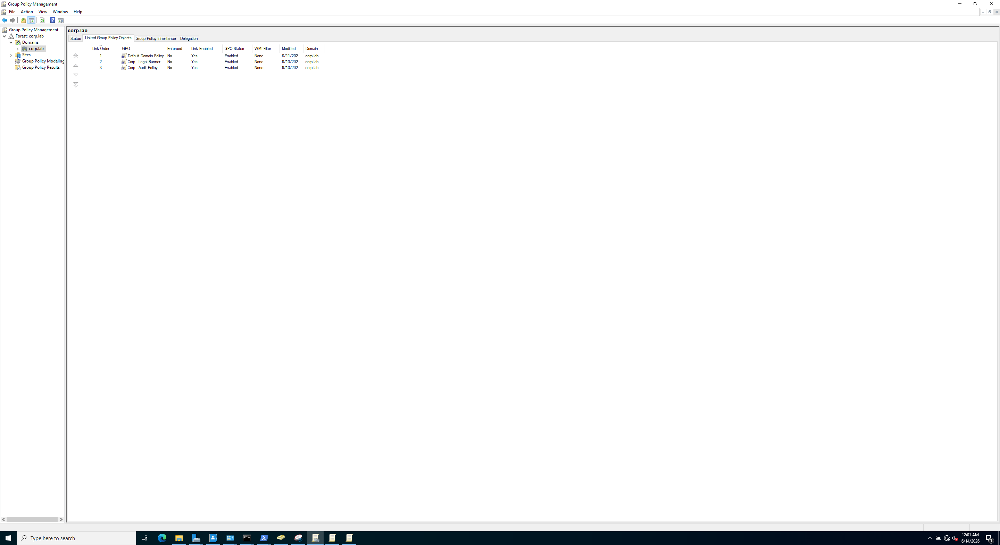
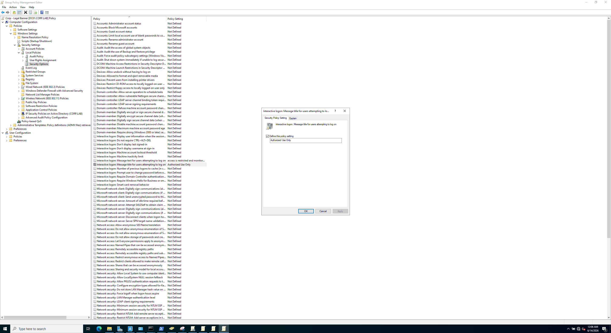
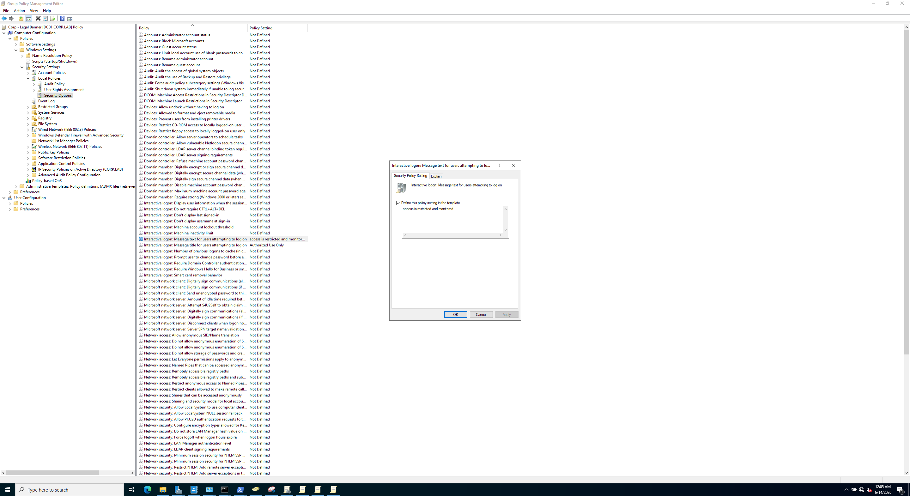
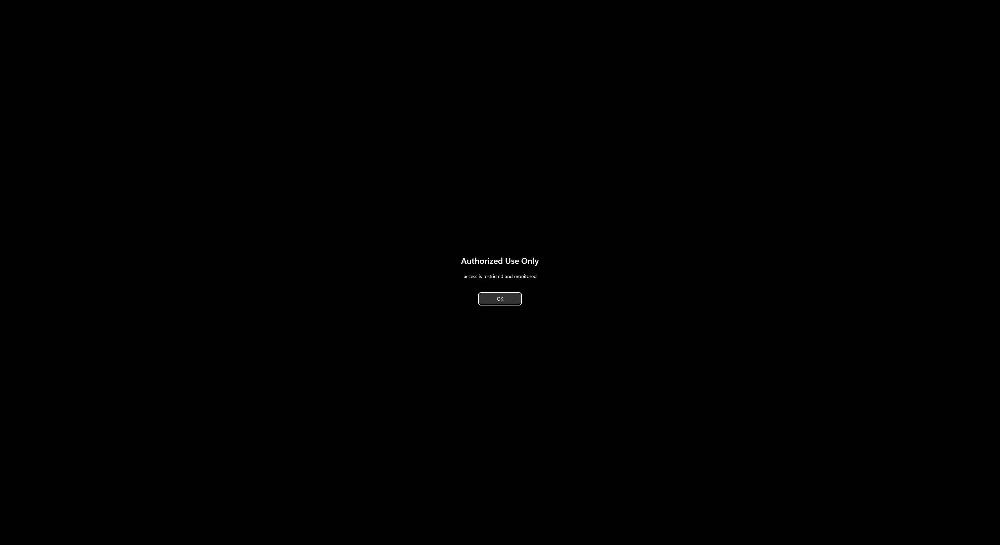

# 02 — Group Policy

Two GPOs: a visible one to prove policy enforcement works, and the audit policy that turns on the logging the SIEM needs. Both created on DC01 via Group Policy Management.

## GPO 1 — Legal logon banner

Linked to the `corp.lab` domain: Computer Configuration → Policies → Windows Settings → Security Settings → Local Policies → Security Options.

- **Interactive logon: Message title** → `Authorized Use Only`
- **Interactive logon: Message text** → a warning that access is restricted and monitored

The banner appears before the WIN11 login screen 

## GPO 2 — Advanced audit policy (feeds the SIEM)

This is the one that makes detection possible. Computer Configuration → Policies → Windows Settings → Security Settings → Advanced Audit Policy Configuration. Turned on:

| Category | Subcategory | Gives you |
|----------|-------------|-----------|
| Account Logon | Kerberos Authentication Service | Event 4768 |
| Account Logon | Kerberos Service Ticket Ops | Event 4769 (Kerberoasting) |
| Logon/Logoff | Logon | Events 4624 / 4625 (spray) |
| Account Management | User Account Management | Event 4720 (new accounts) |
| DS Access | Directory Service Access | Event 4662 (BloodHound) |

## Apply and verify

```
gpupdate /force
```

Verified with the banner appearing at login and `gpresult /r` listing both GPOs under "Applied Group Policy Objects."









