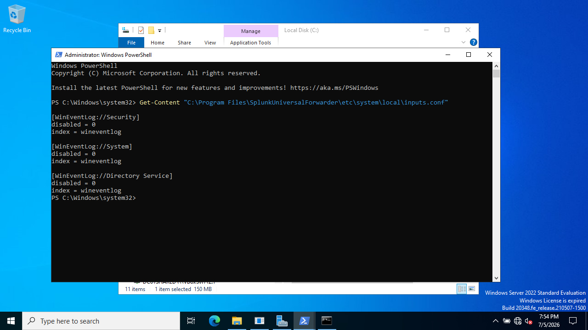
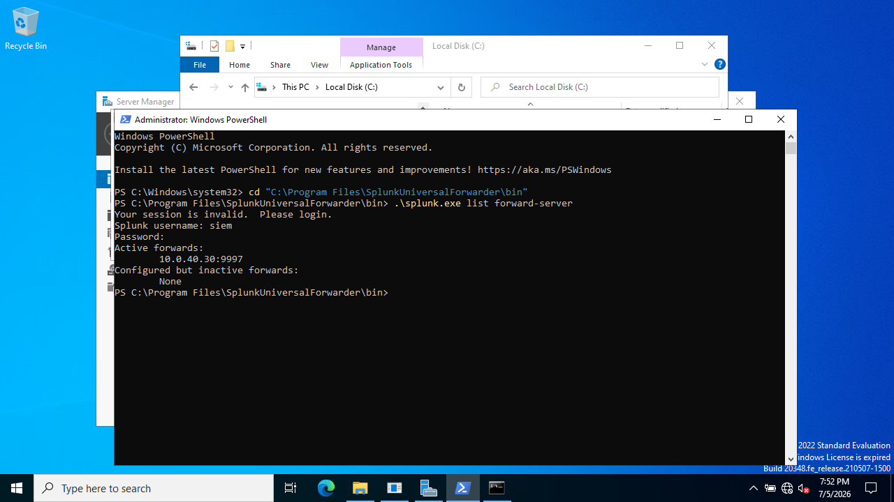
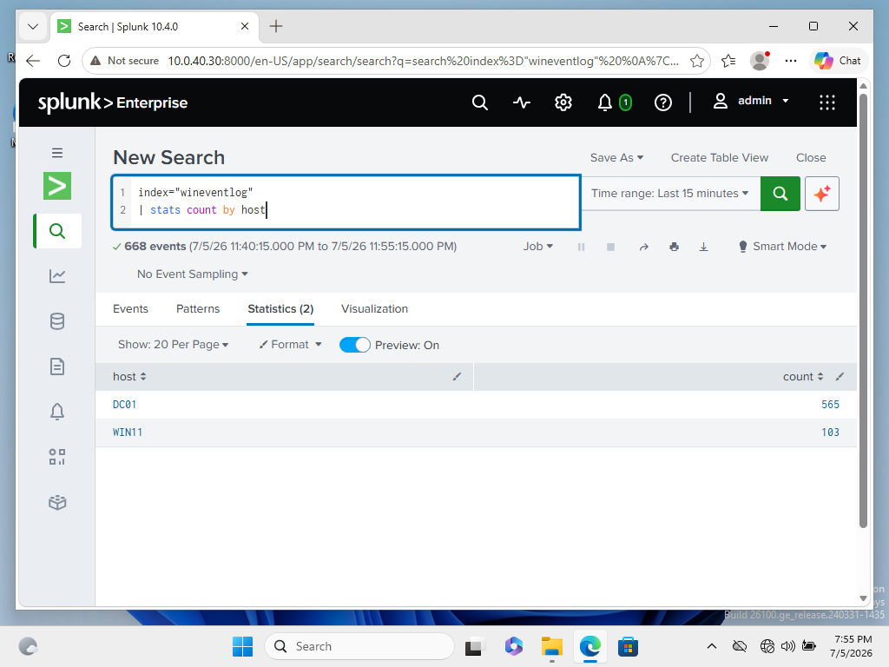
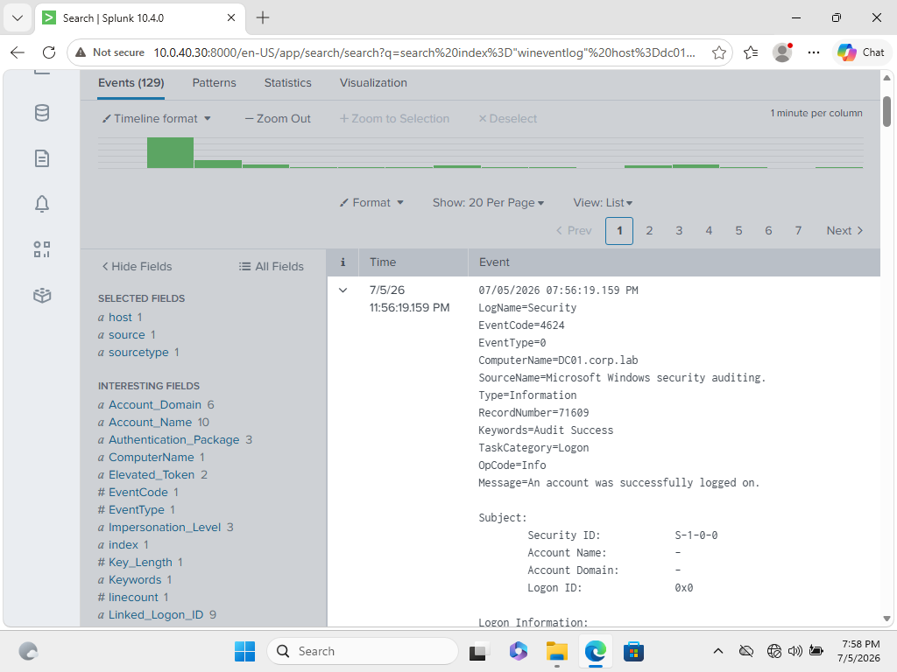
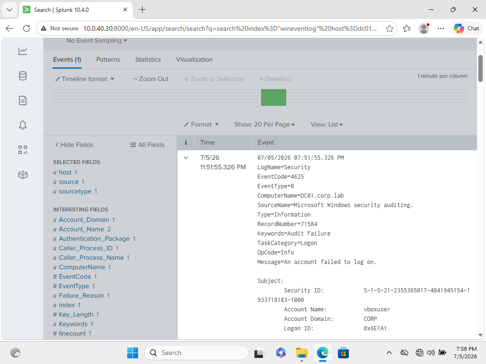

# 03 — Standing Up the SIEM

A SIEM is like a security camera for the network because it collects logs from every machine in one place. I added a 4th VM as the log sink, installed Splunk Free, and shipped Windows Security, System, Directory Service, and Sysmon telemetry from DC01 and WIN11 via Universal Forwarders.

## Splunk on the SIEM VM

```bash
sudo dpkg -i splunk*.deb
sudo /opt/splunk/bin/splunk start --accept-license
sudo /opt/splunk/bin/splunk enable boot-start

# open the receiver port so forwarders can connect
sudo /opt/splunk/bin/splunk enable listen 9997
```

Splunk Web at `http://10.0.40.30:8000`, changed the license group to **Free**, and created two indexes under Settings → Indexes: `wineventlog` and `endpoint` (Sysmon).

## Universal Forwarders on DC01 and WIN11

Installed the forwarder MSI 

`inputs.conf` in `C:\Program Files\SplunkUniversalForwarder\etc\system\local\`. On WIN11:

```ini
[WinEventLog://Security]
disabled = 0
index = wineventlog

[WinEventLog://System]
disabled = 0
index = wineventlog
```

On DC01, the same plus the Directory Service channel (it's the domain controller). 

```powershell
sc.exe config SplunkForwarder obj= LocalSystem
Restart-Service SplunkForwarder
```

## Verifying end to end

The forwarder config that ships the logs:



Forward-server pointed at the indexer:



Confirmed both hosts reporting in:

```
index=wineventlog | stats count by host
```



Then live logins showed up in seconds — a successful and a failed logon:

```
index=wineventlog EventCode=4624
```






